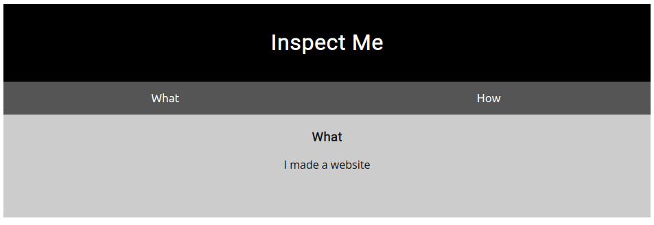
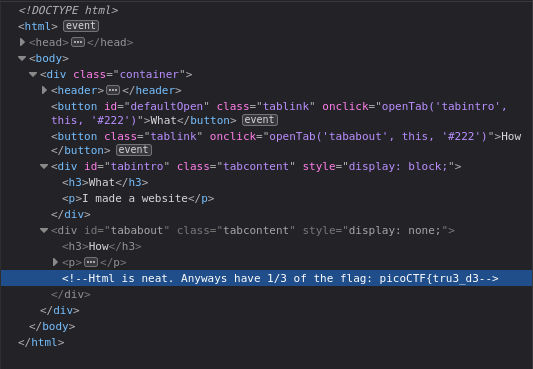
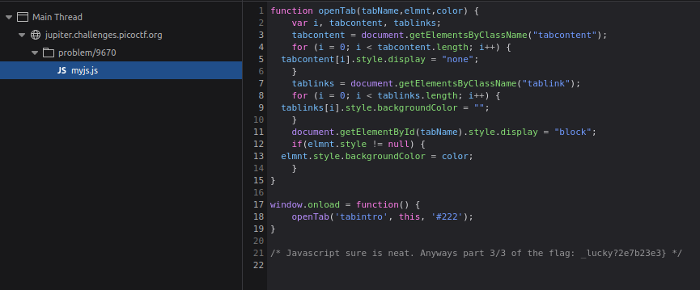

# Insp3ctor

Kishor Balan tipped us off that the following code may need inspection: 
`https://jupiter.challenges.picoctf.org/problem/9670/` ([link](https://jupiter.challenges.picoctf.org/problem/9670/)) or http://jupiter.challenges.picoctf.org:9670


When we first enter the site this is what we are greeted with: 



If we press Q and inspect the website we can find the first part of the flag located in a comment in the HTML code: 



```html
<-- Html is neat. Anyways have 1/3 of the flag: picoCTF{tru3_d3 -->
```

Continuing on, we can inspect the `mycss.css` file and the second part of the flag is located at the bottom: 


```css
/* You need CSS to make pretty pages. Here's part 2/3 of the flag: t3ct1ve_0r_ju5t */
```

The last part of the flag is located in the JS file `myjs.js`: 



```js
/* Javascript sure is neat. Anyways part 3/3 of the flag: _lucky?2e7b23e3} */
```

Put it all together and we have the flag!

picoCTF{tru3_d3t3ct1ve_0r_ju5t_lucky?2e7b23e3}